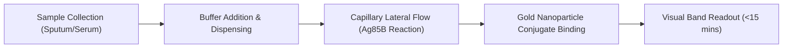
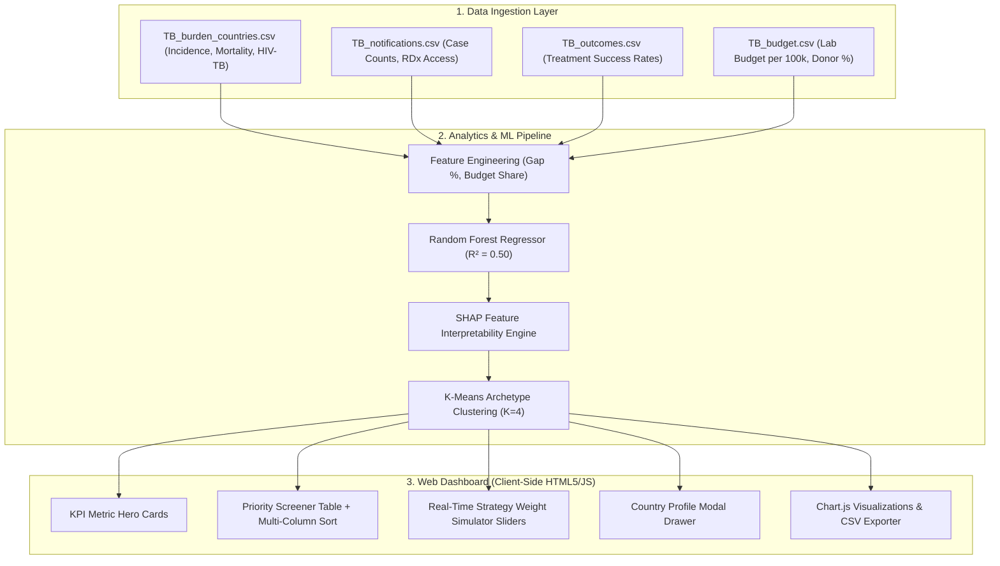

# 📋 Product Requirements Document (PRD): Ag85B POC LFA & Diagnostic Intelligence Platform

> **Document Version:** 1.0 (Final)  
> **Status:** Approved for Translational Pilot Phase  
> **Author & Lead Investigator:** Mathana Vetrivel | MS by Research, IIT Madras  
> **Institution:** Indian Institute of Technology Madras  
> **Target Products:** 
> 1. **Ag85B Lateral Flow Immunoassay (LFA) Diagnostic Cassette** (Hardware/Assay)  
> 2. **Global Diagnostic Gap Intelligence & Target Screener** (Software/Analytics)  
> **Live Platform:** [`dashboard/index.html`](file:///D:/tb%20dataset/dashboard/index.html) | [GitHub Repository](https://github.com/Mathedu-pandian/tb-diagnostic-gap-analysis)  

---

## 1. Product Overview & Objectives

### 1.1 Background & Problem Definition
An estimated **3.0+ million active Tuberculosis (TB) cases** are missed annually by health systems worldwide. Conventional diagnostics rely on centralized sputum smear microscopy (low sensitivity ~50%) or expensive molecular PCR platforms (GeneXpert at $10–$30/test, requiring uninterrupted electricity, air conditioning, and trained lab technicians). In low- and middle-income countries (LMICs), long travel distances and multi-day lab turnaround lead to high patient loss-to-follow-up before treatment initiation.

### 1.2 Product Solution
1. **Physical Product (Ag85B LFA Cassette):** An equipment-free, point-of-care rapid diagnostic test strip utilizing gold nanoparticle-conjugated polyclonal antibodies targeting the secreted **Ag85B antigen** in human samples. Delivers visual readouts in **<15 minutes** at a production cost target of **<$1.50 per test**.
2. **Software Product (Diagnostic Intelligence Platform):** A client-side machine learning and prioritization system built on 24 years of WHO Global TB Programme open data (2000–2024 across 200+ countries) to identify high-impact deployment markets.

### 1.3 Intellectual Property (IP) & International Patent Rights Expansion Strategy
While initial priority patent applications are established via the Indian Patent Office (IPO, Chennai), securing commercial exclusivity and achieving sustainable **Product-Market Fit (PMF)** requires strategic international patent protection beyond India prior to regional market entry:
- **WIPO PCT International Filing:** File via the Patent Cooperation Treaty (PCT) system within the 12-month priority window to secure global priority rights across 150+ contracting states.
- **Sub-Saharan Africa Regional IP (ARIPO / OAPI):** Regional patent entry covering high-burden, donor-dependent target markets (e.g. DR Congo `COD`, Angola `AGO`, South Sudan `SSD`, Lesotho `LSO`).
- **Southeast Asia & Western Pacific (ASEAN / WPR):** Direct national phase patent filings in top priority screening targets (e.g. Philippines `PHL`, Myanmar `MMR`, Papua New Guinea `PNG`, Cambodia `KHM`).
- **Global Health Procurement Hubs:** File in key diagnostic manufacturing and licensing jurisdictions (e.g. South Africa, Singapore, Switzerland) to facilitate OEM contract manufacturing, technology transfer, and Global Fund procurement eligibility.

---

## 2. User Personas & User Stories

### 2.1 Target Personas
- **Persona A — Field Clinic Nurse / Healthcare Worker (Field End-User):** Works in remote primary health centers with erratic power supply; needs rapid, simple, clear diagnostic tools.
- **Persona B — National TB Program (NTP) Director (Procurement Officer):** Ministry official responsible for national diagnostic guidelines, health budget allocation, and case notification metrics.
- **Persona C — Global Health Grant Auditor (Global Fund / USAID):** International donor evaluating health Return-on-Investment (ROI) and cost-per-detected-case across funded LMICs.

### 2.2 User Stories

| ID | Persona | User Story | Acceptance Criteria |
| :--- | :--- | :--- | :--- |
| **US-01** | Field Nurse | As a field nurse, I want to perform a TB test without electricity or lab instruments, so that I can diagnose patients in 15 minutes during a single clinic visit. | Test requires zero power; visual line readout appears in $<15$ minutes; storage stable up to $40^\circ\text{C}$. |
| **US-02** | NTP Director | As an NTP director, I want to identify which health districts/countries have high missing case gaps despite high lab budgets, so that I can deploy POC triage strips where centralized labs are congested. | System identifies Cluster 1 high-gap/high-budget nations and calculates a composite priority ranking score. |
| **US-03** | Grant Auditor | As a Global Fund auditor, I want to adjust priority metrics (gap %, incidence, lab budget, RDx access) in real-time, so that I can model different procurement grant allocation scenarios. | Interactive weight sliders recalculate priority scores across all countries in real-time without page reloads. |

---

## 3. Functional Requirements (FRs)

### 3.1 Hardware / Immunoassay Requirements

- **FR-HW-01 (Biomarker Target):** Assay MUST target the secreted antigen **Ag85B** (*Mycobacterium tuberculosis*).
- **FR-HW-02 (Limit of Detection):** Analytical Limit of Detection (LOD) MUST be $\le 0.6\text{ ng/mL}$ with linearity $R^2 \ge 0.95$.
- **FR-HW-03 (Execution Time):** Visual line readout MUST develop clearly within **10–15 minutes** post sample application.
- **FR-HW-04 (Power & Equipment):** Cassette MUST operate **100% equipment-free** (no batteries, readers, or external power source required).

### 3.2 Software / Analytics Requirements

- **FR-SW-01 (Data Panel Integration):** Software MUST ingest 4 core WHO Global TB Programme datasets covering 2000–2024 panel years:
  1. Burden estimates (incidence, mortality, HIV-TB burden).
  2. Notifications (case counts, rapid test / RDx usage).
  3. Outcomes (treatment success rates).
  4. Budgets (lab budget per 100k, donor dependency %).
- **FR-SW-02 (Machine Learning Engine):** Model MUST train a Random Forest Regressor on pooled country-years (2015–2022) using country-held-out validation to predict case detection rates ($R^2 \ge 0.45$, $\text{MAE} \le 10\%$).
- **FR-SW-03 (Explainable AI / SHAP):** Software MUST generate SHAP feature attribution values for key financing and infrastructure predictors.
- **FR-SW-04 (Composite Priority Formula):** System MUST calculate a composite LFA Priority Index:
  $$\text{Priority Score} = w_1(\text{Gap \%}) + w_2(\text{Incidence / 100k}) + w_3(1 - \text{RDx Coverage}) + w_4(1 - \text{Lab Budget Share})$$
- **FR-SW-05 (Dynamic Weight Simulator):** User MUST be able to adjust weights $w_1, w_2, w_3, w_4$ via real-time sliders and re-rank the country priority table instantly.
- **FR-SW-06 (Data Exporter):** Software MUST support one-click export of filtered and scored target datasets to `.csv` format.

---

## 4. Non-Functional Requirements (NFRs)

### 4.1 Assay Performance & Environmental Specifications

| ID | Parameter | Requirement Specification | Validation Method |
| :--- | :--- | :--- | :--- |
| **NFR-01** | **Unit Cost Ceiling** | <$1.50 per cassette at scale (>1M units/year). | Bill of Materials (BOM) & scale manufacturing model. |
| **NFR-02** | **Clinical Sensitivity** | ≥ 85% vs. sputum culture gold standard in active TB. | Multi-site clinical field evaluation trials. |
| **NFR-03** | **Clinical Specificity** | ≥ 95% vs. non-TB symptomatic controls. | Clinical specificity trial panel (N ≥ 500). |
| **NFR-04** | **Shelf Life** | 18 to 24 months stored at 4°C to 40°C. | Accelerated thermal stability testing (45°C/75% RH). |
| **NFR-05** | **Humidity Tolerance** | Fully functional up to 90% relative humidity (sealed pouch). | Environmental chamber testing. |

### 4.2 Software System Performance & Usability

- **NFR-SW-01 (Load Time):** Web dashboard MUST render initial UI in <300 ms on standard web browsers.
- **NFR-SW-02 (Client-Side Independence):** Web app MUST operate fully client-side (HTML5/CSS3/ES6 JS) with zero mandatory backend server dependencies.
- **NFR-SW-03 (Responsiveness):** UI MUST automatically adapt layout across desktop (>1200px), tablet (768px–1199px), and mobile (<767px) viewports.
- **NFR-SW-04 (Accessibility):** Dark mode theme MUST maintain contrast ratio ≥ 4.5:1 (WCAG AA compliant).

---

## 5. System Architecture & Data Schema

### 📊 System Architecture & Data Schema Breakdown

| Component Layer | Asset / Module | Input Schema / Protocol | Output / Functional Spec |
| :--- | :--- | :--- | :--- |
| **Data Layer** | `TB_burden_countries.csv` | WHO 2000–2024 Panel Data | Baseline country incidence (`e_inc_100k`) & mortality rates. |
| **Data Layer** | `TB_notifications.csv` | WHO Notification Panel | Case notification totals (`c_newinc`) & rapid test % (`rdx_coverage`). |
| **Data Layer** | `TB_budget.csv` | WHO Financial Panel | Lab budget allocation per 100k population (`budget_lab_per100k`). |
| **Analytics Layer** | Feature Engineering | Raw WHO CSV metrics | Diagnostic Gap % (`(inc - notif)/inc * 100`) & Lab Budget share. |
| **Analytics Layer** | Random Forest Regressor | Pooled 2015–2022 panel data | Out-of-fold case detection predictions (R² = 0.50, MAE ≈ 8.9%). |
| **Analytics Layer** | SHAP Interpretability | TreeSHAP Explainer | SHAP feature ranking metrics (Lab Budget = 14.2, RDx = 11.8). |
| **Analytics Layer** | K-Means Clustering | Standardized health features | 4 distinct country archetypes (K=4). |
| **Presentation Layer**| Interactive Web App | Client-side JS (`dashboard/index.html`) | Real-time weight sliders, table sorting, country drawer modal. |

---

## 6. Acceptance Criteria & Definition of Done (DoD)

### 6.1 Hardware / Immunoassay DoD
- [x] Analytical LOD verified at ≤ 0.6 ng/mL with R² ≥ 0.95 using Ag85B recombinant antigen standards.
- [x] Cross-reactivity tested against common non-tuberculous mycobacteria (NTM) species with zero false-positive band formation.
- [x] Test cassette housing designed for 1-step sample application without secondary buffer tubes.

### 6.2 Software & Dashboard DoD
- [x] Merged dataset verified across 200+ countries and 24 panel years (2000–2024).
- [x] Random Forest model achieving out-of-fold R² = 0.50 and MAE ≈ 8.9% on unseen country health systems.
- [x] Web dashboard equipped with real-time weight sliders, country profile modals, column sorting, and CSV exporter.
- [x] Repository published to GitHub with live deployment enabled on GitHub Pages.

---

## 7. Risk Analysis & Mitigation Matrix

| Risk ID | Risk Description | Severity | Probability | Mitigation Strategy |
| :--- | :--- | :---: | :---: | :--- |
| **R-01** | High missingness in WHO budget & RDx reporting in specific low-income countries. | Medium | High | Use pooled panel years (2015–2022) and cross-sectional median imputation with sensitivity analysis. |
| **R-02** | Cross-reactivity with non-tuberculous mycobacteria (NTM) causing false positives. | High | Low | Epitope mapping and polyclonal antibody affinity purification against Ag85B-specific peptide fragments. |
| **R-03** | Supply chain price spikes in gold nanoparticle conjugate materials exceeding <$1.50 target. | Medium | Medium | Establish multi-source chemical precursor suppliers and optimize gold nanoparticle loading density per strip. |
| **R-04** | Delays in WHO Prequalification (PQ) regulatory approval timeline. | High | Medium | Initiate early WHO PQ pre-submission consultations and align clinical trial protocols with ISO 13485 standards. |
| **R-05** | Lack of patent coverage in international target deployment markets. | High | Medium | File WIPO PCT application within 12-month priority window; enter ARIPO/OAPI regional phase and ASEAN national phase. |

---

## 8. Success Metrics & Key Performance Indicators (OKRs)

- **Objective 1 (Diagnostic Reach):** Deploy LFA cassettes to Phase 1 target countries (e.g. Papua New Guinea, Myanmar, Philippines) covering >65% of undetected cases in Cluster 1 regions.
- **Objective 2 (Diagnostic Yield):** Increase baseline case detection rate in target pilot districts by **+25%** within 18 months of guidelines integration.
- **Objective 3 (Economic Efficiency):** Achieve a **50%–60% reduction** in diagnostic health system cost per case detected compared to centralized PCR molecular platforms.
