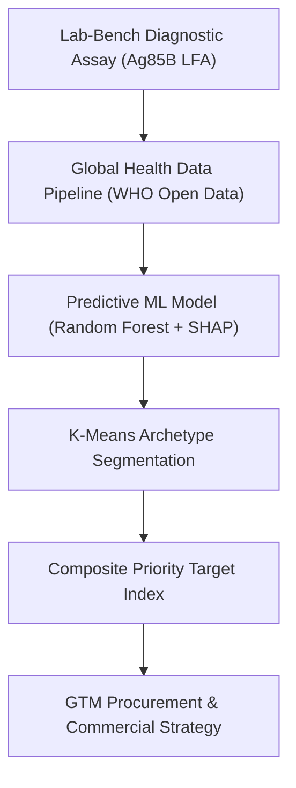
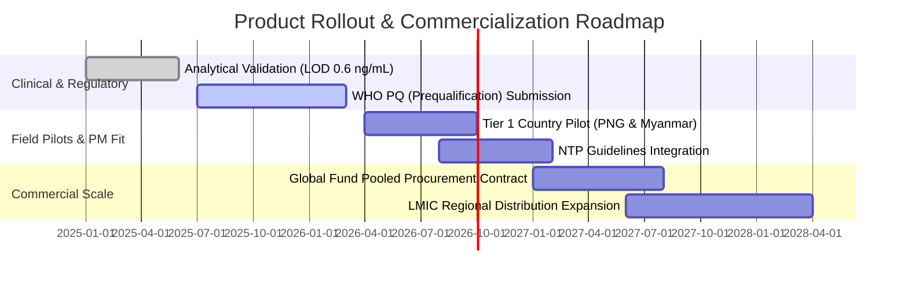

# Product Strategy Case Study: Global TB Diagnostic Gap & Point-of-Care Market Intelligence

> **Role Focus:** Technical Product Manager / Biotech & HealthTech PM / Growth & Strategy PM  
> **Author:** Mathedu Pandian (Maddy) | MS by Research, Biomedical Engineering, IIT Madras  
> **Live Interactive Dashboard:** [`dashboard/index.html`](file:///D:/tb%20dataset/dashboard/index.html)  

---

## Executive Summary

Over **3 million active tuberculosis (TB) cases** estimated by the World Health Organization (WHO) go undetected or unreported every year. This massive "missing cases" gap is primarily concentrated in low- and middle-income countries (LMICs) with limited laboratory infrastructure, high donor dependency, and centralized diagnostic bottlenecks.

This project bridges **benchtop bio-engineering** (developing a gold nanoparticle-based polyclonal antibody lateral flow immunoassay for the Ag85B antigen; $LOD = 0.6\text{ ng/mL}$, $R^2 = 0.972$) with **global market intelligence**. By aggregating 24 years of WHO open data (2000–2024 across 200+ countries), we built an end-to-end Machine Learning and prioritization pipeline to identify top go-to-market (GTM) target countries where low-cost, point-of-care (POC) rapid diagnostic test strips deliver maximum epidemiological impact and product market fit.

---

## 1. Product Vision & Strategy



### Problem Statement & Market Friction
- **Centralized Lab Bottlenecks:** Existing molecular diagnostics (e.g. GeneXpert) cost \$10–\$30 per test and require electricity, trained technicians, and air-conditioned lab environments.
- **The Diagnostic Gap:** In LMICs, up to **50–80% of estimated active cases** are never diagnosed due to long travel distances, high out-of-pocket costs, and lab backlogs.
- **Market Opportunity:** Equipment-free, cassette-based Lateral Flow Immunoassays (LFA) priced at **<\$1.50 per test** enable non-specialized health workers in primary healthcare clinics to diagnose active TB within 15 minutes.

---

## 2. Customer & User Personas

| Persona | Role | Key Pain Points | Value Proposition |
| :--- | :--- | :--- | :--- |
| **National TB Program (NTP) Directors** | Health Ministry Officials | High diagnostic cost per detected case; unreached rural populations. | Scalable diagnostic coverage; lower overall health system cost. |
| **Global Health Donors (Global Fund, USAID, WHO)** | Grant & Procurement Managers | High capital expenditure for instrument-heavy diagnostics. | Higher return on investment per dollar spent; rapid scale in LMICs. |
| **Primary Healthcare Workers & Nurses** | Field Diagnostic End-Users | Complex sample prep; electricity dependence; multi-day patient wait times. | Equipment-free, 15-minute point-of-care test requiring minimal training. |

---

## 3. Data Architecture & Predictive Modeling

### Datasets Merged
1. **TB Burden Estimates:** Country-level incidence, mortality, and HIV-TB co-infection rates.
2. **Case Notifications:** Actual notified cases and rapid diagnostic test (RDx) usage.
3. **Treatment Outcomes:** Success rates across new and relapse cohorts.
4. **National TB Budgets:** Laboratory funding per capita, total budget share, and domestic vs. donor funding breakdown.

### Machine Learning Model & Explainability
- **Architecture:** Random Forest Regressor trained on pooled 2015–2022 country-year panel using **country-held-out out-of-fold validation**.
- **Model Performance:** $R^2 = 0.50$, Mean Absolute Error (MAE) $\approx 8.9\%$ on unseen country health systems.
- **SHAP Interpretability:**
  1. `budget_lab_per100k`: Strongest positive driver of case detection rate.
  2. `rdx_coverage_pct`: Non-linear threshold effect—case detection drops exponentially when rapid test access is below 30%.
  3. `donor_dependency_pct`: High donor dependency (>75%) correlates with volatile annual case reporting.

---

## 4. Market Segmentation (K-Means Archetypes)

Countries were clustered ($K=4$) into diagnostic archetypes to tailor product entry positioning:


### Strategic Archetype Breakdown:
1. **Cluster 1 — High Budget, High Gap (9 Key Countries, e.g., Philippines, Papua New Guinea, Angola):**
   - *Characteristics:* High mean incidence (472/100k), ~50% diagnostic gaps despite top lab budgets.
   - *GTM Positioning:* High-throughput POC triage strips to unlock lab capacity.
2. **Cluster 2 — Severely Under-Resourced (42 Countries):**
   - *Characteristics:* Low lab budget per capita, heavy reliance on donor funding.
   - *GTM Positioning:* Global Fund subsidized bulk procurement.

---

## 5. Composite LFA Target Priority Score & Ranking

The **LFA Priority Score** is a transparent, multi-dimensional screening algorithm:

$$\text{Priority Score} = 0.40(\text{Diagnostic Gap \%}) + 0.30(\text{Incidence / 100k}) + 0.20(1 - \text{RDx Coverage}) + 0.10(1 - \text{Lab Budget Share})$$

### Top 10 Go-To-Market Priority Countries (2021 Cross-Section)

| Rank | Country | WHO Region | Incidence / 100k | Missing Cases | Diagnostic Gap % | Priority Score | Strategic Tier |
| :---: | :--- | :---: | :---: | :---: | :---: | :---: | :---: |
| **#1** | **Papua New Guinea** | WPR | 622.0 | 33,127 | 53.4% | **0.855** | Tier 1 Priority |
| **#2** | **Mongolia** | WPR | 421.0 | 11,291 | 80.7% | **0.786** | Tier 1 Priority |
| **#3** | **Djibouti** | EMR | 392.0 | 2,601 | 59.1% | **0.782** | Tier 1 Priority |
| **#4** | **Myanmar** | SEA | 353.0 | 123,590 | 65.7% | **0.781** | Tier 1 Priority |
| **#5** | **South Sudan** | AFR | 339.0 | 19,532 | 52.8% | **0.721** | Tier 1 Priority |
| **#6** | **Lesotho** | AFR | 606.0 | 9,510 | 67.9% | **0.718** | Tier 1 Priority |
| **#7** | **Angola** | AFR | 371.0 | 66,309 | 51.8% | **0.712** | Tier 1 Priority |
| **#8** | **DR Congo** | AFR | 401.0 | 182,592 | 46.0% | **0.697** | Tier 1 Priority |
| **#9** | **Cambodia** | WPR | 279.0 | 25,411 | 54.1% | **0.690** | Tier 1 Priority |
| **#10**| **Central African Rep** | AFR | 446.0 | 9,784 | 42.5% | **0.681** | Tier 1 Priority |

---

## 6. Product Roadmap & Strategic Recommendations



### Product Metrics & Success KPIs (OKRs)
- **Primary Metric:** % increase in baseline Case Detection Rate across Tier 1 target countries (Target: +25% within 18 months of rollout).
- **Economic Metric:** Reduction in diagnostic procurement cost per detected case (Target: 50% cost savings vs GeneXpert).
- **Usability Metric:** Field clinician test completion & interpretation accuracy (>98% agreement rate in non-lab environments).

---

## How to Talk About This Project in Product Interviews

### Q: "Tell me about a technical project where you bridged data analysis with product strategy."
> *"In my research at IIT Madras, I developed a point-of-care rapid diagnostic strip for Tuberculosis with an analytical LOD of 0.6 ng/mL. To turn this benchtop assay into a viable product strategy, I analyzed 24 years of WHO data across 200+ countries, built a Random Forest machine learning model to predict case detection gaps, and created a composite prioritization matrix. This allowed us to target 9 high-burden countries where diagnostic gaps persist despite high lab budgets, creating a clear market entry strategy for low-cost POC diagnostics."*

---

## Repository Structure & Quick Start

```bash
# Clone the repository
git clone https://github.com/Mathedu-pandian/tb-diagnostic-gap-analysis.git
cd tb-diagnostic-gap-analysis

# Install dependencies
pip install -r requirements.txt

# Open interactive dashboard locally
# Double click or open dashboard/index.html in any browser
```
