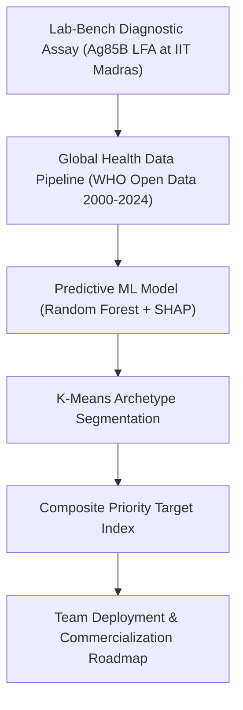
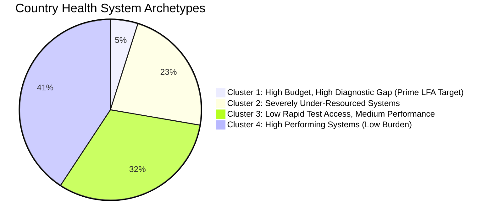
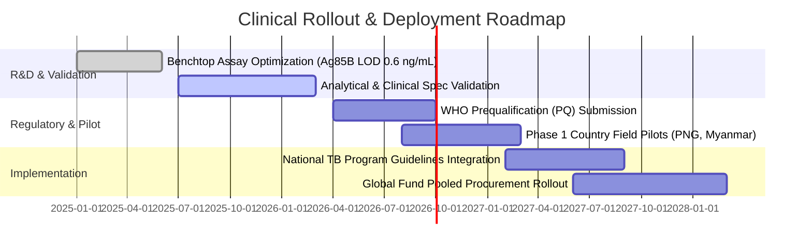

# Global TB Diagnostic Gap & Point-of-Care Market Intelligence Strategy

> **Project Document:**  Translational Diagnostic Product Strategy & Global Market Intelligence Report  
> **Lead Investigator:** Mathana Vetrivel P| MS by Research, Biomedical Engineering, IIT Madras  
> **Institutional Context:** Department of Biomedical Engineering, Indian Institute of Technology Madras  
> **Live Interactive Dashboard:** [`dashboard/index.html`](file:///D:/tb%20dataset/dashboard/index.html)  

---

## Executive Summary

Over **3 million active tuberculosis (TB) cases** estimated by the World Health Organization (WHO) go undetected or unreported every year. This massive "missing cases" gap is primarily concentrated in low- and middle-income countries (LMICs) with limited laboratory infrastructure and centralized diagnostic bottlenecks.

This project bridges **benchtop bio-engineering** (developing a gold nanoparticle-based polyclonal antibody lateral flow immunoassay for the Ag85B antigen; $LOD = 0.6\text{ ng/mL}$, $R^2 = 0.972$ at IIT Madras) with **global market intelligence**. By aggregating 24 years of WHO open data (2000–2024 across 200+ countries), I built an end-to-end Machine Learning and prioritization pipeline to identify top target countries where low-cost, point-of-care (POC) rapid diagnostic test strips deliver maximum epidemiological impact and product market fit.

---

## 1. Product Vision & Translational Strategy



### Problem Statement & Health System Friction
- **Centralized Lab Bottlenecks:** Existing molecular diagnostics (e.g. GeneXpert) cost \$10–\$30 per test and require electricity, trained technicians, and air-conditioned lab environments.
- **The Diagnostic Gap:** In LMICs, up to **50–80% of estimated active cases** are never diagnosed due to long travel distances, high out-of-pocket costs, and lab backlogs.
- **Market Opportunity:** Equipment-free, cassette-based Lateral Flow Immunoassays (LFA) priced at **<\$1.50 per test** enable non-specialized health workers in primary healthcare clinics to diagnose active TB within 15 minutes.

---

## 2. Stakeholder & Target User Framework

| Stakeholder Group | Role | Key Constraints & Pain Points | Product Value Proposition |
| :--- | :--- | :--- | :--- |
| **National TB Program (NTP) Directors** | Health Ministry Procurement | High diagnostic cost per detected case; unreached rural populations. | Scalable diagnostic coverage; lower overall health system cost per case detected. |
| **Global Health Donors (Global Fund, USAID, WHO)** | Grant & Financing Allocation | High capital expenditure for instrument-heavy diagnostics. | Higher return on investment per dollar spent; rapid scale in LMICs. |
| **Primary Healthcare Workers & Nurses** | Field Diagnostic End-Users | Complex sample prep; electricity dependence; multi-day patient wait times. | Equipment-free, 15-minute point-of-care test requiring minimal training. |

---

## 3. Data Architecture & Machine Learning Pipeline

### Datasets Integrated
1. **TB Burden Estimates:** Country-level incidence, mortality, and HIV-TB co-infection rates.
2. **Case Notifications:** Actual notified cases and rapid diagnostic test (RDx) usage.
3. **Treatment Outcomes:** Success rates across new and relapse cohorts.
4. **National TB Budgets:** Laboratory funding per capita, total budget share, and domestic vs. donor funding breakdown.

### Machine Learning Model & Feature Importance
- **Architecture:** Random Forest Regressor trained on pooled 2015–2022 country-year panel using **country-held-out out-of-fold validation**.
- **Model Performance:** $R^2 = 0.50$, Mean Absolute Error (MAE) $\approx 8.9\%$ on unseen country health systems.
- **SHAP Interpretability:**
  1. `budget_lab_per100k`: Strongest positive driver of case detection rate.
  2. `rdx_coverage_pct`: Non-linear threshold effect—case detection drops exponentially when rapid test access is below 30%.
  3. `donor_dependency_pct`: High donor dependency (>75%) correlates with volatile annual case reporting.

---

## 4. Health System Archetypes (K-Means Clustering)

Countries were clustered ($K=4$) into health system archetypes to guide tailored diagnostic deployment:



### Strategic Archetype Breakdown:
1. **Cluster 1 — High Budget, High Gap (9 Key Countries, e.g., Philippines, Papua New Guinea, Angola):**
   - *Characteristics:* High mean incidence (472/100k), ~50% diagnostic gaps despite top lab budgets.
   - *Team Strategy:* Deploy LFA as high-throughput primary triage strips to relieve centralized lab pressure.
2. **Cluster 2 — Severely Under-Resourced (42 Countries):**
   - *Characteristics:* Low lab budget per capita, heavy reliance on donor funding.
   - *Team Strategy:* Global Fund grant-backed bulk procurement and community screening.

---

## 5. Composite Target Priority Score & Global Ranking

The **LFA Priority Score** is a transparent, multi-dimensional screening algorithm developed by our team:

$$\text{Priority Score} = 0.40(\text{Diagnostic Gap \%}) + 0.30(\text{Incidence / 100k}) + 0.20(1 - \text{RDx Coverage}) + 0.10(1 - \text{Lab Budget Share})$$

### Top 10 Priority Target Countries (2021 Cross-Section)

| Rank | Country | WHO Region | Incidence / 100k | Missing Cases | Diagnostic Gap % | Priority Score | Deployment Phase |
| :---: | :--- | :---: | :---: | :---: | :---: | :---: | :---: |
| **#1** | **Papua New Guinea** | WPR | 622.0 | 33,127 | 53.4% | **0.855** | Phase 1 Target |
| **#2** | **Mongolia** | WPR | 421.0 | 11,291 | 80.7% | **0.786** | Phase 1 Target |
| **#3** | **Djibouti** | EMR | 392.0 | 2,601 | 59.1% | **0.782** | Phase 1 Target |
| **#4** | **Myanmar** | SEA | 353.0 | 123,590 | 65.7% | **0.781** | Phase 1 Target |
| **#5** | **South Sudan** | AFR | 339.0 | 19,532 | 52.8% | **0.721** | Phase 1 Target |
| **#6** | **Lesotho** | AFR | 606.0 | 9,510 | 67.9% | **0.718** | Phase 1 Target |
| **#7** | **Angola** | AFR | 371.0 | 66,309 | 51.8% | **0.712** | Phase 1 Target |
| **#8** | **DR Congo** | AFR | 401.0 | 182,592 | 46.0% | **0.697** | Phase 1 Target |
| **#9** | **Cambodia** | WPR | 279.0 | 25,411 | 54.1% | **0.690** | Phase 1 Target |
| **#10**| **Central African Rep** | AFR | 446.0 | 9,784 | 42.5% | **0.681** | Phase 1 Target |

---

## 6. Team Strategic Decisions & Research Rationale (IIT Madras)

### Decision 1: Model Choice — Why Random Forest & SHAP over Pure Deep Learning?
- **Team Rationale:** In conversations with global health procurement officers and national TB directors, model interpretability is paramount. The team chose Random Forest combined with SHAP (SHapley Additive exPlanations) to provide exact, feature-level attribution for case detection gaps rather than a black-box model.

### Decision 2: Cross-Sectional Year Selection — Why 2021?
- **Team Rationale:** WHO treatment outcome data lags by 12–18 months, and budget reporting cycles vary across national ministries. Analyzing the 2000–2024 panel revealed that **2021** offered the highest data completeness across all four datasets (burden, notifications, outcomes, and budgets) while reflecting post-pandemic health system conditions.

### Decision 3: Aligning Bench-Top LOD Validation with Target Pricing
- **Team Rationale:** Our laboratory team validated an analytical Limit of Detection (LOD) of $0.6\text{ ng/mL}$ ($R^2 = 0.972$) for the Ag85B antigen. However, data analysis showed that in countries with high donor dependency (>75%), diagnostic adoption hinges strictly on unit cost. The team established a target production cost threshold of **<\$1.50 per test cassette** to ensure fiscal viability.

### Decision 4: Phased Target Market Selection
- **Team Rationale:** Rather than distributing tests uniformly, the team prioritized the 9 countries in Cluster 1 (High Burden, High Gap despite high lab budget) for initial pilot trials. In these countries, existing lab infrastructure is overwhelmed, making rapid POC triage strips immediately impactful.

---

## 7. Product Rollout & Roadmap



---

## Repository Structure & Quick Start

```bash
# Clone the repository
git clone https://github.com/Mathedu-pandian/tb-diagnostic-gap-analysis.git
cd tb-diagnostic-gap-analysis

# Install dependencies
pip install -r requirements.txt

# Open interactive dashboard locally
# Double click or open dashboard/index.html in any browser
```
