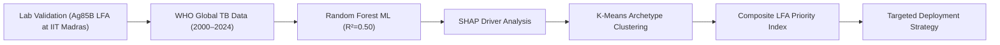

# ⚡ Global TB Diagnostic Gap & Point-of-Care Market Intelligence Platform

> **Translating Laboratory Immunoassay Validation into a Global Product & Deployment Strategy**  
> **Lead Investigator:** Mathana Vetrivel | MS by Research, IIT Madras  
> **Institution:** Indian Institute of Technology Madras  
> **GitHub:** [@Mathedu-pandian](https://github.com/Mathedu-pandian)  

[](https://www.python.org/)
[](https://scikit-learn.org/)
[](https://shap.readthedocs.io/)
[](PRODUCT_CASE_STUDY.md)

---

## 🌟 Quick Links & Demonstrations

- 📄 **[Translational Strategy & Market Intelligence Report (PRD)](PRODUCT_CASE_STUDY.md)** — Detailed Research & Deployment Strategy, Team Decision Rationale, Stakeholder Matrix & Technical Spec.
- 📊 **[Interactive Product Intelligence Dashboard (`dashboard/index.html`)](dashboard/index.html)** — Live client-side interactive matrix, SHAP impact explorer, and country cluster screener.
- 📓 **[Jupyter Data Pipeline Notebook](notebooks/TB_Diagnostic_Gap_Analysis.ipynb)** — End-to-end data processing, Random Forest ML model, SHAP plots, and K-Means segmentation.
- 📈 **[Top 20 Priority Target Dataset](outputs/tb_top20_lfa_targets.csv)** — Exported priority country dataset for low-cost Point-of-Care (POC) deployment.

---

## 🎯 Executive Overview & Research Context

Over **3 million active tuberculosis (TB) cases** estimated by the World Health Organization (WHO) go undetected or unreported each year. This diagnostic gap is largest in low- and middle-income countries (LMICs) with limited laboratory infrastructure, high donor dependency, and centralized lab bottlenecks.

This project bridges **benchtop bio-engineering** with **global product strategy**:
1. **Benchtop Bio-Engineering Context:** Developing a polyclonal antibody-based gold nanoparticle lateral flow immunoassay (LFA) for TB diagnostics targeting the **Ag85B antigen** ($\text{LOD} = 0.6\text{ ng/mL}$, $R^2 = 0.972$) at IIT Madras.
2. **Translational Market Strategy:** Combining 24 years of WHO open data (2000–2024 across 200+ countries) to identify *where* equipment-free, low-cost ($<\$1.50$) rapid diagnostic strips will achieve the highest epidemiological impact and health system adoption.



---

## 💡 Key Team Findings & Strategic Decisions

1. **High Budget $\neq$ Low Diagnostic Gap:**  
   Clustering reveals a distinct archetype of **9 high-burden countries** (mean incidence 472/100k) where diagnostic gaps remain high (~50%) *despite* having the highest average lab budgets in the dataset (e.g., Philippines, Papua New Guinea, Angola). Centralized lab infrastructure alone cannot close the gap—validating the strong need for rapid point-of-care test cassettes as primary triage tools.
2. **Rapid Test Access is the Critical Bottleneck:**  
   SHAP interpretability shows that rapid diagnostic test (RDx) coverage and lab budget per 100k population are the strongest non-linear predictors of case detection rates.
3. **Top Priority Target Markets:**  
   The composite priority algorithm ranks **Papua New Guinea, Mongolia, Djibouti, Myanmar, South Sudan, Lesotho, Angola, DR Congo, Cambodia, and Central African Republic** as Phase 1 market entry targets.

---

## 📊 Priority Ranking Algorithm

The **LFA Priority Score** provides a transparent, multi-dimensional screening tool developed by our team:

$$\text{Priority Score} = 0.40(\text{Diagnostic Gap \%}) + 0.30(\text{Incidence / 100k}) + 0.20(1 - \text{RDx Coverage}) + 0.10(1 - \text{Lab Budget Share})$$

| Rank | ISO3 | Country | WHO Region | Incidence / 100k | Missing Cases | Diagnostic Gap % | Priority Score | Deployment Phase |
| :---: | :--- | :--- | :---: | :---: | :---: | :---: | :---: | :---: |
| **#1** | PNG | Papua New Guinea | WPR | 622.0 | 33,127 | 53.4% | **0.855** | Phase 1 Target |
| **#2** | MNG | Mongolia | WPR | 421.0 | 11,291 | 80.7% | **0.786** | Phase 1 Target |
| **#3** | DJI | Djibouti | EMR | 392.0 | 2,601 | 59.1% | **0.782** | Phase 1 Target |
| **#4** | MMR | Myanmar | SEA | 353.0 | 123,590 | 65.7% | **0.781** | Phase 1 Target |
| **#5** | SSD | South Sudan | AFR | 339.0 | 19,532 | 52.8% | **0.721** | Phase 1 Target |

*For the complete 200+ country dataset, inspect [`outputs/tb_scored_2021_full.csv`](outputs/tb_scored_2021_full.csv) or open [`dashboard/index.html`](dashboard/index.html).*

---

## 🛠️ Repository Structure

```
tb_project/
├── README.md                              # Main Product & Technical Repository Guide
├── PRODUCT_CASE_STUDY.md                  # Comprehensive Strategy & Team Decision Report
├── requirements.txt                       # Python dependencies
├── .gitignore                             # Git ignore configuration
├── dashboard/
│   └── index.html                         # Interactive Web Dashboard & Screener App
├── data/                                  # Raw WHO Global TB datasets
│   ├── TB_burden_countries_2026-07-05.csv
│   ├── TB_notifications_2026-07-05.csv
│   ├── TB_outcomes_2026-07-05.csv
│   └── TB_budget_2026-07-05.csv
├── notebooks/
│   ├── TB_Diagnostic_Gap_Analysis.ipynb          # Clean, Colab-ready Jupyter pipeline
│   └── TB_Diagnostic_Gap_Analysis_executed.ipynb # Executed notebook with cached outputs
└── outputs/
    ├── tb_scored_2021_full.csv            # Full country dataset with features & scores
    └── tb_top20_lfa_targets.csv           # Top 20 priority target countries export
```

---

## 🚀 How to Run

### 1. Interactive Dashboard (No Installation Required)
Open [`dashboard/index.html`](dashboard/index.html) directly in any web browser to explore the interactive matrix, SHAP model drivers, and country archetypes.

### 2. Python Notebook & Data Pipeline
```bash
# Clone the repository
git clone https://github.com/Mathedu-pandian/tb-diagnostic-gap-analysis.git
cd tb-diagnostic-gap-analysis

# Install dependencies
pip install -r requirements.txt

# Launch Jupyter Notebook
jupyter notebook notebooks/TB_Diagnostic_Gap_Analysis.ipynb
```

---

## ✉️ Contact & Institutional Affiliation

**Mathana Vetrivel**  
MS by Research Candidate  
Indian Institute of Technology Madras (IIT Madras)  
GitHub: [https://github.com/Mathedu-pandian](https://github.com/Mathedu-pandian)  
Email: `mathedu3002@gmail.com`
