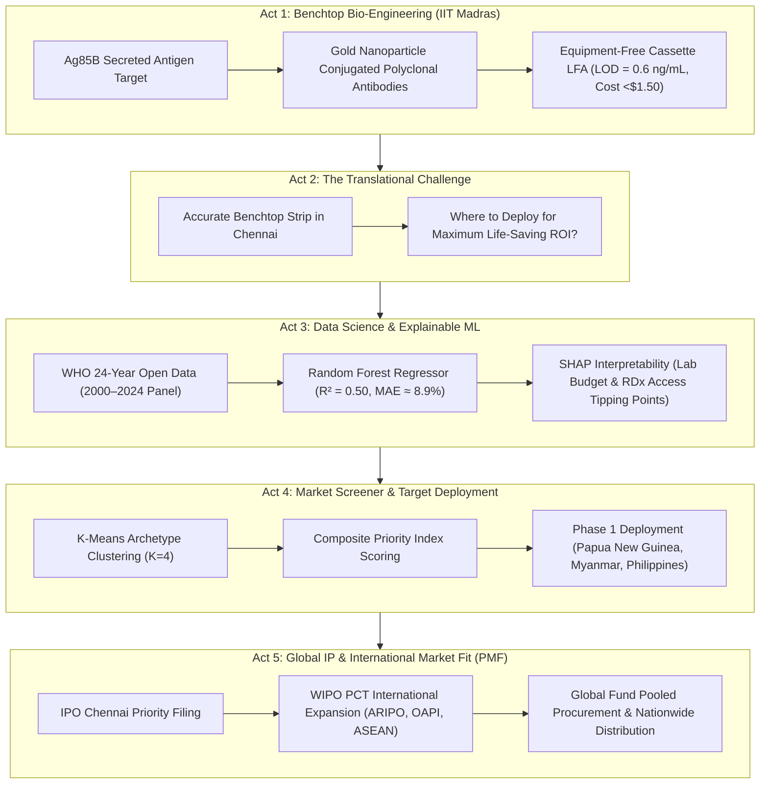

# ⚡ Global TB Diagnostic Gap & Point-of-Care Market Intelligence Platform

> 🌐 **Live Interactive Dashboard:** [https://Mathedu-pandian.github.io/tb-diagnostic-gap-analysis/](https://Mathedu-pandian.github.io/tb-diagnostic-gap-analysis/)  
> **Lead Investigator:** Mathana Vetrivel | MS by Research, IIT Madras  
> **Institutional Context:** Indian Institute of Technology Madras  
> **GitHub:** [@Mathedu-pandian](https://github.com/Mathedu-pandian)  

[](https://Mathedu-pandian.github.io/tb-diagnostic-gap-analysis/)
[](https://www.python.org/)
[](https://scikit-learn.org/)
[](https://shap.readthedocs.io/)
[](PRD.md)

---

## 🌟 Quick Links & Key Artifacts

- 🌐 **[Live Interactive Dashboard (GitHub Pages)](https://Mathedu-pandian.github.io/tb-diagnostic-gap-analysis/)** — Real-time strategy weight simulator, priority target screener, SHAP model drivers, and country profile drawer.
- 📋 **[Product Requirements Document (`PRD.md`)](PRD.md)** — Formal hardware & software technical specifications, user stories, acceptance criteria (DoD), and international IP strategy.
- 📄 **[Translational Strategy & Case Study (`PRODUCT_CASE_STUDY.md`)](PRODUCT_CASE_STUDY.md)** — Product Vision, Stakeholder Framework, Team Decision Rationales, and Commercialization Roadmap.
- 📓 **[Jupyter Data Pipeline Notebook](notebooks/TB_Diagnostic_Gap_Analysis.ipynb)** — Executable pipeline covering WHO data ingestion, Random Forest modeling, SHAP plots, and K-Means segmentation.
- 📈 **[Top 20 Priority Target Dataset](outputs/tb_top20_lfa_targets.csv)** — Exported priority country targets for point-of-care rapid test deployment.

---

## 🚨 Problem Statement: Why We Need This Work

### 1. The Global Undetected Crisis
Tuberculosis (TB) remains one of the world's deadliest infectious killers, causing **1.3+ million deaths annually**. While over 10.6 million people develop active TB each year, **more than 3.0 million cases go completely undetected or unreported** to health authorities worldwide. 

### 2. The Human & Epidemiological Toll
Every single untreated person with active TB infects **10 to 15 additional people** in their community each year. Missing 3 million cases annually sustains an ongoing cycle of transmission, drug resistance emergence, and preventable mortality—disproportionately impacting low- and middle-income countries (LMICs).

### 3. The Failure of Centralized Diagnostic Infrastructure
The root cause of this massive diagnostic gap is not lack of medical intent, but severe **infrastructure friction**:
- **Centralized Lab Dependency:** Standard diagnostics rely on sputum smear microscopy (which misses ~50% of active cases) or expensive molecular PCR systems like GeneXpert ($10–$30 per test).
- **Environmental Constraints:** Molecular PCR machines require continuous electricity, climate-controlled laboratories, and specialized lab technicians—resources virtually non-existent in rural primary health clinics.
- **Patient Loss-to-Follow-Up:** Patients in remote LMIC regions must walk long distances to submit sample specimens and return days later for results. Up to **60% of patients are lost to follow-up** before lab results return, leaving them untreated.

---

## 📖 The Translational Follow-Up Story: From Lab Bench to Global Deployment



### 🔬 Act 1: The Bio-Engineering Breakthrough at IIT Madras
To eliminate electricity and lab equipment dependencies, our team at the **Indian Institute of Technology Madras (IIT Madras)** engineered a Point-of-Care (POC) Lateral Flow Immunoassay (LFA) cassette. By targeting the **Ag85B antigen** (a biomarker actively secreted by *Mycobacterium tuberculosis* during early infection) using gold nanoparticle-conjugated polyclonal antibodies, the assay achieves an analytical Limit of Detection (**LOD = 0.6 ng/mL**, $R^2 = 0.972$). The test requires **zero power**, yields visual line readouts in **<15 minutes**, and targets a mass-production unit cost of **<$1.50 per strip**.

### ❓ Act 2: The Translation Dilemma
Developing an accurate diagnostic strip on a lab bench in Chennai is only half the battle. A low-cost test cannot save lives if it sits in a warehouse or is deployed in health systems where centralized labs are already underutilized. **How do health ministries and global donors identify which countries will benefit most from POC rapid test deployment?**

### 🧠 Act 3: Data Science & Explainable Machine Learning
To solve this translation challenge, we ingested 24 years of WHO Global TB Programme open data (2000–2024 across 200+ countries) covering disease burden, case notifications, treatment outcomes, and national lab budgets. We trained a **Random Forest Regressor** ($R^2 = 0.50$, $\text{MAE} \approx 8.9\%$) using country-held-out validation. Using **SHAP (SHapley Additive exPlanations)**, we discovered that rapid diagnostic test (RDx) coverage and lab budget per 100k population exert non-linear tipping points—case detection rates drop precipitously when rapid test access falls below **30%**.

### 🎯 Act 4: High-Impact Priority Screener & Archetype Deployment
Using K-Means clustering ($K=4$), we segmented 200+ countries into distinct health system archetypes. Crucially, we identified **Cluster 1 (9 High-Burden Nations)**—countries like Papua New Guinea, Myanmar, the Philippines, and Angola that maintain high lab budgets yet suffer ~50% diagnostic gaps due to severe lab backlogs. For these nations, our LFA cassette serves as a high-throughput **primary triage tool**. We developed a multi-metric composite LFA Priority Index to rank target deployment markets objectively.

### 🌐 Act 5: Global IP & International Product-Market Fit (PMF)
Achieving sustainable Product-Market Fit (PMF) requires securing commercial freedom-to-operate and patent protection across target deployment markets. Beyond initial priority filings at the **Indian Patent Office (IPO, Chennai)**, we established a **WIPO Patent Cooperation Treaty (PCT)** international expansion framework targeting regional IP offices (**ARIPO** and **OAPI** in sub-Saharan Africa, **ASEAN** national phase entries in Asia-Pacific, and manufacturing hubs in Singapore and Switzerland) to enable Global Fund pooled procurement and LMIC nationwide distribution.

---

## 📊 Priority Ranking Algorithm & Top Target Markets

The **LFA Priority Score** provides a transparent, multi-dimensional screening tool developed by our team:

$$\text{Priority Score} = 0.40(\text{Diagnostic Gap \%}) + 0.30(\text{Incidence / 100k}) + 0.20(1 - \text{RDx Coverage}) + 0.10(1 - \text{Lab Budget Share})$$

| Rank | ISO3 | Country | WHO Region | Estimated Incidence / 100k | Missing Cases | Diagnostic Gap % | Priority Score | Deployment Phase |
| :---: | :--- | :--- | :---: | :---: | :---: | :---: | :---: | :---: |
| **#1** | `PNG` | **Papua New Guinea** | WPR | 622.0 | 33,127 | 53.4% | **0.855** | Phase 1 Target |
| **#2** | `MNG` | **Mongolia** | WPR | 421.0 | 11,291 | 80.7% | **0.786** | Phase 1 Target |
| **#3** | `DJI` | **Djibouti** | EMR | 392.0 | 2,601 | 59.1% | **0.782** | Phase 1 Target |
| **#4** | `MMR` | **Myanmar** | SEA | 353.0 | 123,590 | 65.7% | **0.781** | Phase 1 Target |
| **#5** | `SSD` | **South Sudan** | AFR | 339.0 | 19,532 | 52.8% | **0.721** | Phase 1 Target |
| **#6** | `LSO` | **Lesotho** | AFR | 606.0 | 9,510 | 67.9% | **0.718** | Phase 1 Target |
| **#7** | `AGO` | **Angola** | AFR | 371.0 | 66,309 | 51.8% | **0.712** | Phase 1 Target |
| **#8** | `COD` | **DR Congo** | AFR | 401.0 | 182,592 | 46.0% | **0.697** | Phase 1 Target |
| **#9** | `KHM` | **Cambodia** | WPR | 279.0 | 25,411 | 54.1% | **0.690** | Phase 1 Target |
| **#10**| `CAF` | **Central African Rep** | AFR | 446.0 | 9,784 | 42.5% | **0.681** | Phase 1 Target |

*For the complete 200+ country dataset, inspect [`outputs/tb_scored_2021_full.csv`](outputs/tb_scored_2021_full.csv) or open [`dashboard/index.html`](dashboard/index.html).*

---

## 🛠️ Repository Structure

```
tb_project/
├── README.md                              # Main Overview, Problem Statement & Narrative Story
├── PRD.md                                 # Formal Product Requirements Document (Hardware & Software)
├── PRODUCT_CASE_STUDY.md                  # Translational Product Strategy & Team Decision Case Study
├── STRATEGY_REPORT.md                     # GTM Strategy & Clinical Deployment Roadmap
├── requirements.txt                       # Python dependencies
├── .gitignore                             # Git ignore configuration
├── dashboard/
│   └── index.html                         # Interactive Web Dashboard & Weight Simulator App
├── data/                                  # Raw WHO Global TB datasets (2000–2024 Panel)
│   ├── TB_burden_countries_2026-07-05.csv
│   ├── TB_notifications_2026-07-05.csv
│   ├── TB_outcomes_2026-07-05.csv
│   └── TB_budget_2026-07-05.csv
├── notebooks/
│   ├── TB_Diagnostic_Gap_Analysis.ipynb          # Clean, Colab-ready Jupyter pipeline
│   └── TB_Diagnostic_Gap_Analysis_executed.ipynb # Executed notebook with cached outputs
└── outputs/
    ├── tb_scored_2021_full.csv            # Full country dataset with features & priority scores
    └── tb_top20_lfa_targets.csv           # Top 20 priority target countries export
```

---

## 🚀 How to Run

### 1. Interactive Dashboard (No Installation Required)
Open [`dashboard/index.html`](dashboard/index.html) directly in any web browser to explore the interactive matrix, SHAP model drivers, and country archetypes, or view the live GitHub Pages link:  
👉 **[Mathedu-pandian.github.io/tb-diagnostic-gap-analysis](https://Mathedu-pandian.github.io/tb-diagnostic-gap-analysis/)**

### 2. Python Notebook & Data Pipeline
```bash
# Clone the repository
git clone https://github.com/Mathedu-pandian/tb-diagnostic-gap-analysis.git
cd tb-diagnostic-gap-analysis

# Install dependencies
pip install -r requirements.txt

# Launch Jupyter Notebook
jupyter notebook notebooks/TB_Diagnostic_Gap_Analysis.ipynb
```

---

## ✉️ Contact & Institutional Affiliation

**Mathana Vetrivel**  
MS by Research Candidate  
Indian Institute of Technology Madras (IIT Madras)  
GitHub: [https://github.com/Mathedu-pandian](https://github.com/Mathedu-pandian)  
Email: `mathedu3002@gmail.com`
