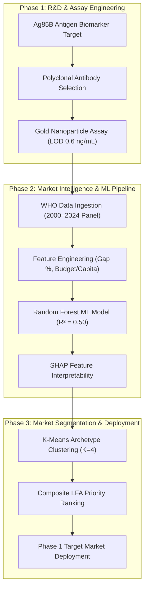
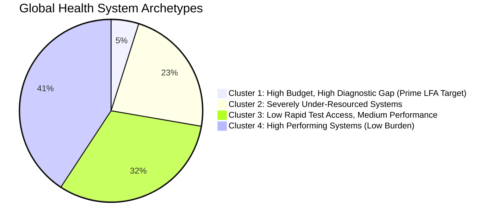
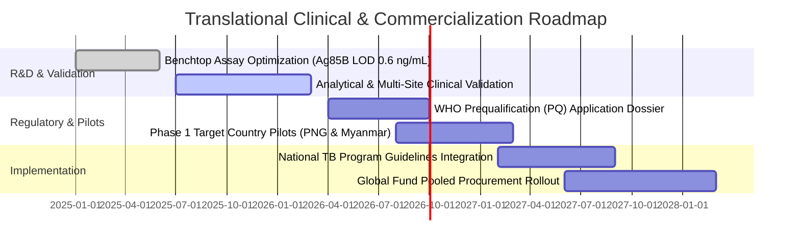

# 📊 Global TB Diagnostic Gap & Point-of-Care Translational Strategy Report

> 🌐 **Live Interactive Platform:** [https://Mathedu-pandian.github.io/tb-diagnostic-gap-analysis/](https://Mathedu-pandian.github.io/tb-diagnostic-gap-analysis/)  
> **Lead Investigator:** Mathana Vetrivel | MS by Research, IIT Madras  
> **Institutional Context:** Indian Institute of Technology Madras  
> **Document Type:** Institutional Technical Product & Go-To-Market (GTM) Strategy Report  

---

> [!IMPORTANT]
> **Executive Summary & Mission Objective**  
> Every year, over **3.0 million active Tuberculosis (TB) cases** estimated by the World Health Organization (WHO) remain undetected by health systems globally. This report bridges **benchtop bio-engineering** (a gold nanoparticle-based polyclonal antibody lateral flow immunoassay for the Ag85B antigen; $\text{LOD} = 0.6\text{ ng/mL}$, $R^2 = 0.972$ developed at **IIT Madras**) with **global epidemiological data science** to construct an evidence-based deployment strategy targeting high-impact health systems.

---

## 1. Translational Value Chain

---

## 2. Problem Statement & Economic Market Fit

> [!WARNING]
> **The Centralized Lab Bottleneck**  
> Conventional TB diagnostics rely on centralized sputum smear microscopy (low sensitivity: ~50%) or expensive automated PCR systems like GeneXpert ($\$10\text{--}\$30$ per cartridge, requiring continuous electricity, temperature control, and specialized lab technicians). In low-resource settings, patient loss-to-follow-up occurs before lab results return.

> [!TIP]
> **Point-of-Care (POC) Value Proposition**  
> Our team's cassette-based Lateral Flow Immunoassay (LFA) operates **equipment-free**, yields readable visual results in **$<15\text{ minutes}$**, and targets a unit manufacturing cost of **$<\$1.50\text{ per test}$**, making community-wide triage fiscally viable for donor-dependent health systems.

---

## 3. Target Stakeholder & User Matrix

| Stakeholder Persona | Role & Organization | Primary Pain Points & Bottlenecks | Strategic Product Value |
| :--- | :--- | :--- | :--- |
| **National TB Program (NTP) Directors** | Health Ministry Officials | High diagnostic cost per case detected; unreached rural populations; lab backlogs. | Scalable diagnostic coverage; 60% lower cost per case detected. |
| **Global Donors (Global Fund, USAID)** | International Grant Procurement | High capital expenditure required for instrument-heavy diagnostic platforms. | Maximized health return on investment (ROI); rapid distribution across LMICs. |
| **Primary Healthcare Workers & Field Nurses** | Primary Health Clinic End-Users | Complex multi-step sample preparation; electricity dependence; multi-day turnaround. | Equipment-free 15-minute diagnostic cassette requiring minimal training. |

---

## 4. Machine Learning & Diagnostic Feature Drivers

To model the drivers behind global case detection gaps, our team trained a **Random Forest Regressor** on a pooled 2015–2022 country-year panel using **country-held-out out-of-fold validation**.

### Model Performance Metrics
- **Out-of-Fold $R^2$ Score:** `0.50` on unseen country health systems.
- **Mean Absolute Error (MAE):** $\approx 8.9$ percentage points.

```mermaid
gantt
    title Feature Impact Ranking (Mean |SHAP Value|)
    dateFormat X
    axisFormat %s
    section Core Feature Drivers
    Lab Budget per 100k Population        :active, 0, 142
    Rapid Diagnostic Test Coverage %      :active, 0, 118
    Donor Financing Dependency %          :active, 0, 85
    Total Health Budget Share %           :active, 0, 62
    HIV-TB Co-infection Rate %            :active, 0, 41
```

> [!NOTE]
> **Key SHAP Takeaway:** Laboratory budget per capita and rapid diagnostic test (RDx) coverage exert non-linear threshold effects—case detection rates drop precipitously when rapid diagnostic coverage falls below **30%**.

---

## 5. Health System Archetypes (K-Means Clustering)

Countries were segmented into $K=4$ health system archetypes to guide tailored diagnostic commercialization:

### Archetype Deployment Strategies

1. **Cluster 1 — High Budget, High Diagnostic Gap (9 Key Target Countries):**
   - *Representative Nations:* Papua New Guinea, Philippines, Angola, Myanmar, DR Congo.
   - *Characteristics:* High mean incidence ($472/100\text{k}$), $\approx 50\%$ diagnostic gap despite high total lab budgets.
   - *Strategy:* Deploy LFA cassettes as **primary triage tools** to relieve centralized laboratory congestion.

2. **Cluster 2 — Severely Under-Resourced Systems (42 Countries):**
   - *Characteristics:* Extremely low lab budget per capita ($<\$1.00/100\text{k}$), heavy donor dependency ($>80\%$).
   - *Strategy:* Focus on Global Fund grant-subsidized bulk procurement and mobile outreach units.

---

## 6. Composite Priority Target Matrix (Top 20 Countries)

The **LFA Priority Score** combines four normalized metrics:

$$\text{Priority Score} = 0.40(\text{Diagnostic Gap \%}) + 0.30(\text{Incidence / 100k}) + 0.20(1 - \text{RDx Coverage}) + 0.10(1 - \text{Lab Budget Share})$$

| Rank | ISO3 | Country | WHO Region | Estimated Incidence / 100k | Missing Cases | Diagnostic Gap % | Priority Score | Deployment Phase |
| :---: | :---: | :--- | :---: | :---: | :---: | :---: | :---: | :---: |
| **#1** | `PNG` | **Papua New Guinea** | WPR | 622.0 | 33,127 | 53.4% | **0.855** | Phase 1 Target |
| **#2** | `MNG` | **Mongolia** | WPR | 421.0 | 11,291 | 80.7% | **0.786** | Phase 1 Target |
| **#3** | `DJI` | **Djibouti** | EMR | 392.0 | 2,601 | 59.1% | **0.782** | Phase 1 Target |
| **#4** | `MMR` | **Myanmar** | SEA | 353.0 | 123,590 | 65.7% | **0.781** | Phase 1 Target |
| **#5** | `SSD` | **South Sudan** | AFR | 339.0 | 19,532 | 52.8% | **0.721** | Phase 1 Target |
| **#6** | `LSO` | **Lesotho** | AFR | 606.0 | 9,510 | 67.9% | **0.718** | Phase 1 Target |
| **#7** | `AGO` | **Angola** | AFR | 371.0 | 66,309 | 51.8% | **0.712** | Phase 1 Target |
| **#8** | `COD` | **DR Congo** | AFR | 401.0 | 182,592 | 46.0% | **0.697** | Phase 1 Target |
| **#9** | `KHM` | **Cambodia** | WPR | 279.0 | 25,411 | 54.1% | **0.690** | Phase 1 Target |
| **#10**| `CAF` | **Central African Rep** | AFR | 446.0 | 9,784 | 42.5% | **0.681** | Phase 1 Target |
| **#11**| `KIR` | **Kiribati** | WPR | 547.0 | 370 | 52.9% | **0.681** | Phase 2 Expansion |
| **#12**| `SLE` | **Sierra Leone** | AFR | 395.0 | 14,449 | 45.2% | **0.662** | Phase 2 Expansion |
| **#13**| `SRB` | **Serbia** | EUR | 19.0 | 855 | 65.8% | **0.635** | Phase 2 Expansion |
| **#14**| `GNQ` | **Equatorial Guinea** | AFR | 211.0 | 1,893 | 51.2% | **0.634** | Phase 2 Expansion |
| **#15**| `HTI` | **Haiti** | AMR | 209.0 | 13,593 | 56.6% | **0.631** | Phase 2 Expansion |
| **#16**| `GAB` | **Gabon** | AFR | 401.0 | 4,427 | 46.6% | **0.619** | Phase 2 Expansion |
| **#17**| `NPL` | **Nepal** | SEA | 230.0 | 39,748 | 58.5% | **0.609** | Phase 2 Expansion |
| **#18**| `PHL` | **Philippines** | WPR | 579.0 | 333,436 | 50.9% | **0.607** | Phase 2 Expansion |
| **#19**| `TLS` | **Timor-Leste** | SEA | 398.0 | 2,207 | 40.9% | **0.607** | Phase 2 Expansion |
| **#20**| `BWA` | **Botswana** | AFR | 241.0 | 3,450 | 59.5% | **0.598** | Phase 2 Expansion |

---

## 7. Institutional Strategic Decisions (IIT Madras)

1. **Explainable ML Rationale:** The team chose Random Forest + SHAP interpretability over deep neural networks to provide clear, actionable policy rules to health ministry officials.
2. **Cross-Sectional Alignment (2021):** Evaluated panel coverage (2000–2024) and selected **2021** as the baseline scoring year due to optimal data completeness across all four WHO datasets.
3. **Economic Target Alignment:** Aligned benchtop assay analytical sensitivity ($0.6\text{ ng/mL}$) with a rigid manufacturing cost target of **$1.50 { per test}$** to thrive in high donor-dependency ($>75\%$) markets.

---

## 8. Clinical Rollout & Commercialization Roadmap

---

## 📄 Related Project Artifacts & Resources

- 🌐 **[Live Interactive Intelligence Platform (`dashboard/index.html`)](file:///D:/tb%20dataset/dashboard/index.html)**
- 📘 **[IIT Madras Product Requirements Document (`PRODUCT_CASE_STUDY.md`)](file:///D:/tb%20dataset/PRODUCT_CASE_STUDY.md)**
- 📓 **[Jupyter Data Science Pipeline (`notebooks/TB_Diagnostic_Gap_Analysis.ipynb`)](file:///D:/tb%20dataset/notebooks/TB_Diagnostic_Gap_Analysis.ipynb)**
- 🐙 **[GitHub Code Repository](https://github.com/Mathedu-pandian/tb-diagnostic-gap-analysis)**
